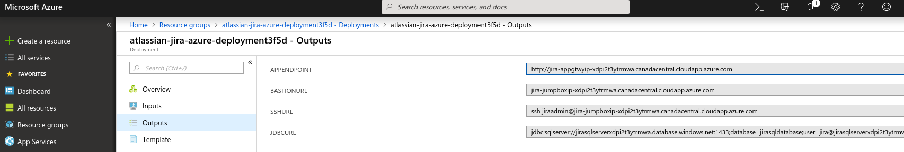

# Atlassian Jira Software Data Center

Jira Software Data Center gives you uninterrupted access to JIRA Software with performance at scale, disaster recovery and instant scalability when hosting our applications in your Azure private cloud account.

## Deploy to Azure Portal

Eason Specical Notes
This is special modified deployment template for deployment into exisiting vNet/Subnet
[az group deployment create --resource-group TestJIRA2 --template-file mainTemplate.json --parameters azuredeploy.parameters.json]

* https://confluence.atlassian.com/adminjiraserver/getting-started-with-jira-data-center-on-azure-938846970.html
* https://bitbucket.org/atlassian/atlassian-azure-deployment/src/92b32869f20df9968e06b26ccb19dfa751d99084/DEVELOPING2.md
* https://bitbucket.org/atlassian/atlassian-azure-deployment/src/master/

NB. The current Azure deployment utilises certain Azure functionality like App Insights, Azure Monitoring, SQL Analytics etc that are still in Preview mode and not available in most regions. To ensure you can utilise these technologies deploy into the following regions:  

1. Canada Central  
2. Central India  
3. East US  
4. Southeast Asia  
5. UK South  
6. West Europe  
7. West US 2  

You can of course disable App Insights, Analytics etc via the template parameters to allow installation to your desired region.  

NB That the templates will download the latest version available from Atlassian Download site. These new releases might introduce breaking changes but you can always specify particular version by updating the jiraVersion parameter.  

Further information on parameters and other installation options for the Atlassian Azure solution can be found at our [Jira Azure Support Page](https://confluence.atlassian.com/adminjiraserver075/getting-started-with-jira-data-center-on-azure-937183335.html)  

## View Azure Deployment Results

View deployment output values in Azure Portal for endpoints, DB url etc.  

